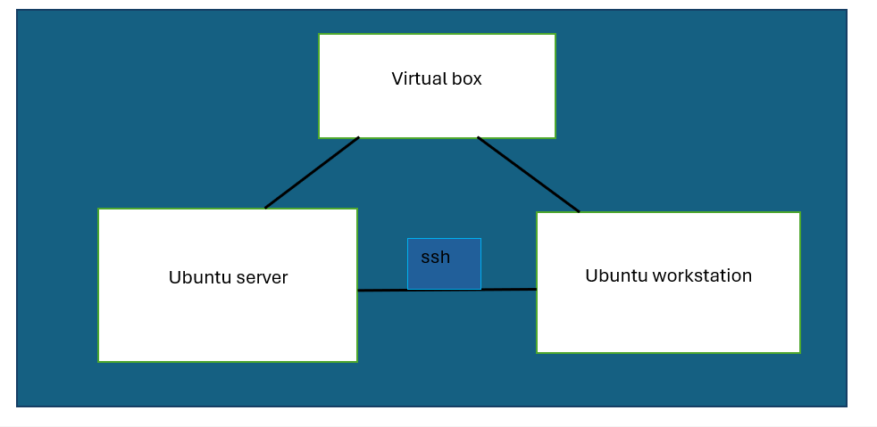
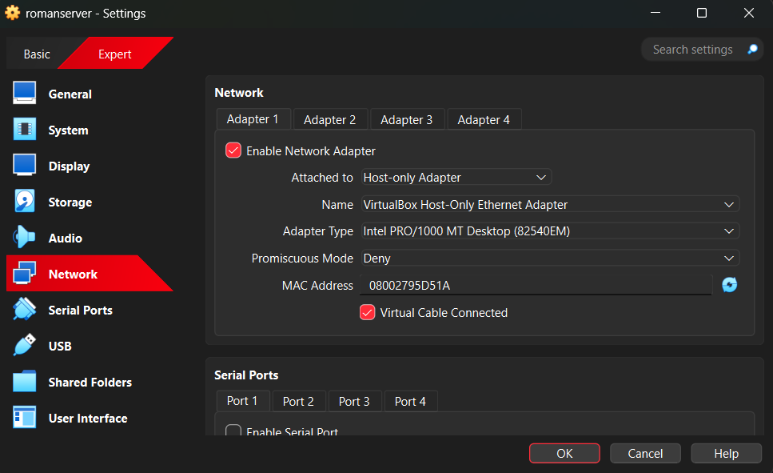
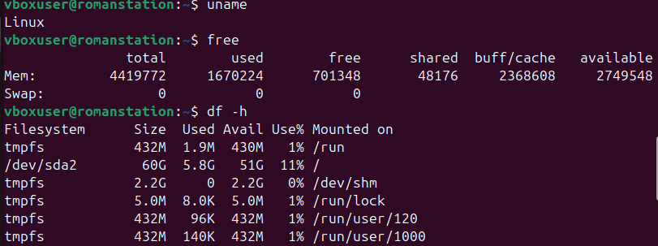

# System Architecture Diagram and Description

## Architecture Overview
The system consists of two virtual machines hosted on VirtualBox:

- Ubuntu Server (acts as the server)
- Ubuntu Desktop (acts as the workstation)

Both systems communicate over a Host-Only network while maintaining internet access through NAT.

## Logical Architecture Diagram

Host Machine
|
|-- VirtualBox Host-Only Network (192.168.56.0/24)
|     |-- Ubuntu Server VM (192.168.56.10)
|     |-- Ubuntu Workstation VM (192.168.56.20)
|
|-- NAT Network (Internet Access)

## Purpose
- Server provides centralized services
- Workstation is used for administration and testing
- Separation improves security and scalability

# Distribution Selection Justification

## Selected Server Distribution
Ubuntu Server 22.04 LTS

## Justification
Ubuntu Server was selected due to its stability, long-term support, and strong community support. The LTS version provides five years of security updates, making it suitable for both learning and production environments.

## Comparison with Alternatives

| Distribution | Advantages | Disadvantages |
|-------------|------------|---------------|
| Ubuntu Server | LTS support, large community, easy package management | Slightly larger footprint |
| Debian | Extremely stable | Older packages |
| CentOS Stream | Enterprise-focused | Rolling release model |
| Rocky Linux | RHEL compatible | Smaller community |

## Conclusion
Ubuntu Server offers the best balance of stability, usability, and long-term support for this project.

# Workstation Configuration Decision

## Selected Workstation
Ubuntu Desktop 22.04 LTS

## Justification
Ubuntu Desktop provides a user-friendly graphical interface while maintaining full Linux functionality. It integrates well with Ubuntu Server and is ideal for system administration tasks.

## Alternatives Considered
- Linux Mint: User-friendly but less enterprise-focused
- Fedora Workstation: Cutting-edge features but shorter support cycle

## CLI Commands
ip address 

uname 

lsb_release

## Conclusion
Ubuntu Desktop was chosen for its ease of use, stability, and compatibility with the selected server distribution.
