# Performance Testing Plan

## Objective:
The goal is to assess the performance of critical applications and infrastructure using remote monitoring to simulate real-world conditions. Performance testing will help in identifying system bottlenecks, resource utilization, and response times.

## Testing Methodology:
### 1. Test Planning:
- Define the performance goals (e.g., response times, throughput, scalability).
- Identify the key applications to test (e.g., web servers, database servers, API services).
- Specify acceptable performance thresholds (e.g., response time < 1s, requests per second > 100).

## Monitoring Tools:
### 2. Use htop for real-time process and resource monitoring:
These tools provide detailed, interactive views of system resource usage, such as CPU, memory, and process consumption. They allow you to monitor system performance in real-time and sort/process data for better analysis.
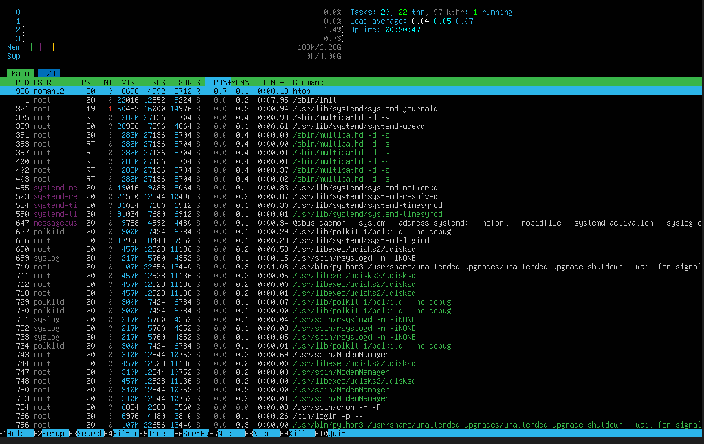

### 3. Utilize iostat for disk and I/O performance monitoring:
iostat offers statistics on CPU usage and input/output (I/O) device performance, helping to identify disk bottlenecks and overall I/O activity, which is crucial for diagnosing disk-related performance issues.
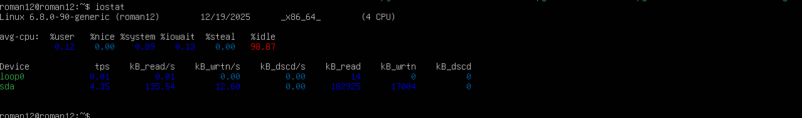

### 4. Use nmon for comprehensive system monitoring:
nmon provides an all-in-one view of CPU, memory, disk I/O, network usage, and more. It can log performance data for later analysis, making it ideal for continuous or long-term monitoring during performance testing or production use.
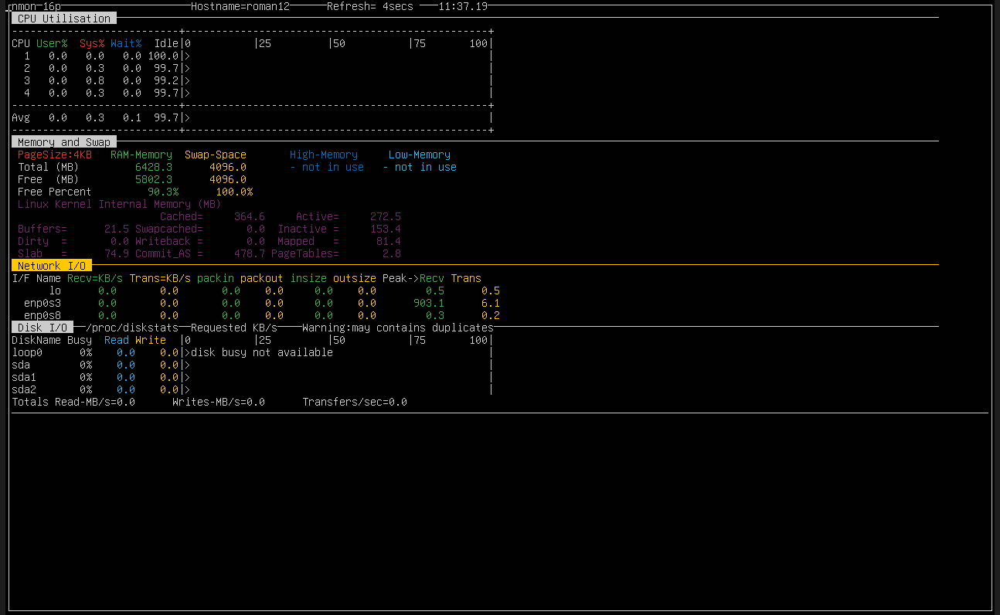

### 5. Use ps aux for detailed process status:
The ps aux command gives you a snapshot of all running processes on the system with detailed information, such as memory and CPU usage, user ownership, and running commands, useful for identifying processes consuming excessive resources.

### 6. Use pstree for visualizing process hierarchies:
pstree displays processes in a tree format, showing their parent-child relationships. This is helpful for identifying how processes are related and tracing resource-heavy applications back to their origin.
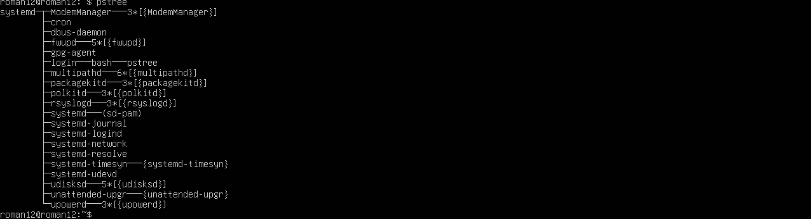

## Test Environment:
- Use a staging environment that mirrors the production environment as closely as possible (including hardware specifications, network conditions, etc.).
- Ensure sufficient logging is enabled to track system behavior.

## Test Scenarios:
- **Load Testing**: Simulate expected traffic and ensure the system performs well under normal conditions.
htop

iostat

nmon

ps aux

pstree

- **Stress Testing**: Push the system beyond normal operational capacity to identify weaknesses (e.g., high load).
htop
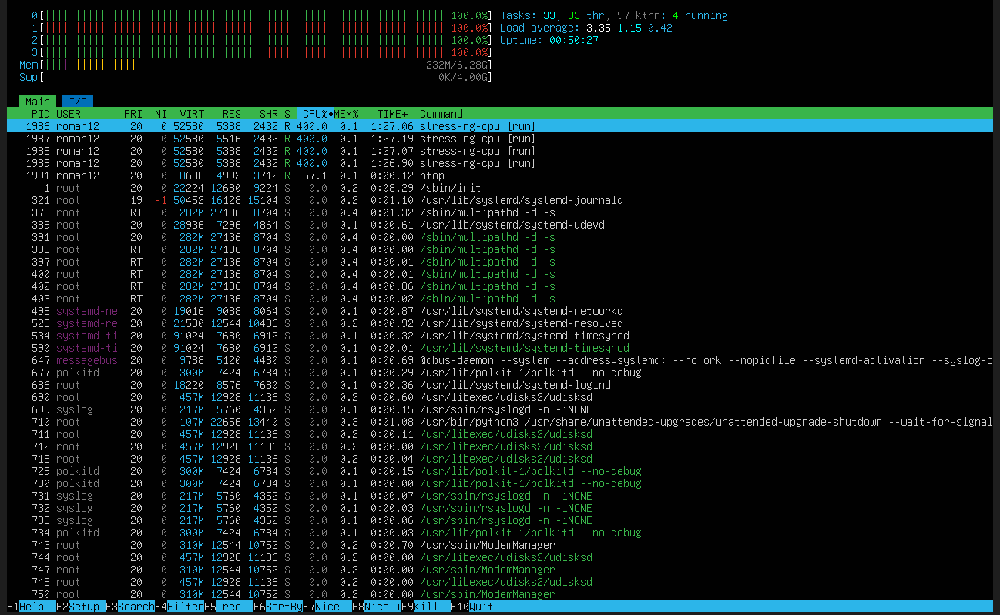

iostat
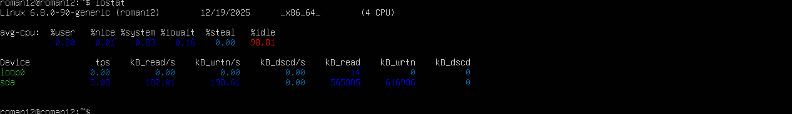

nmon
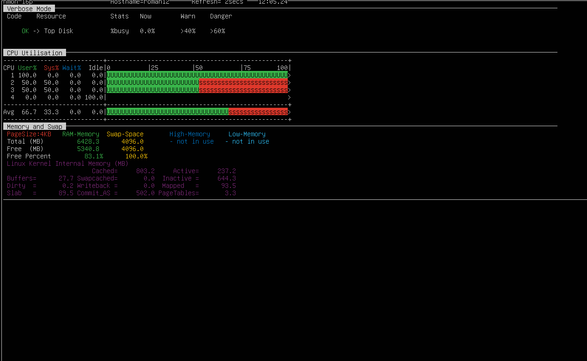

ps aux
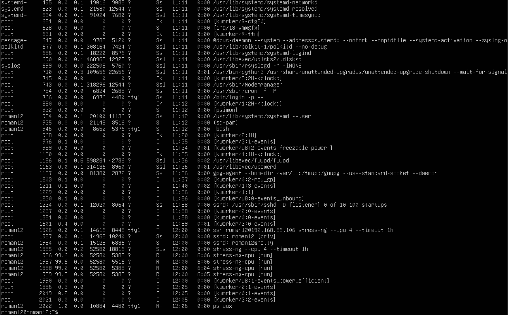

pstree
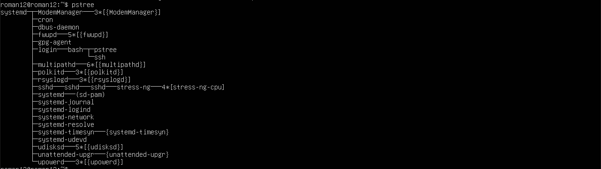

## Test Execution:
- Run multiple tests over a period of time.
- Use remote monitoring tools to collect data during tests (e.g., CPU, RAM, I/O, network usage).
- Collect and analyze logs for any errors or performance degradation.

## Metrics to Monitor:
- CPU Utilization
- Memory Usage
- Network Latency and Throughput
- Disk I/O
- Error Rates (e.g., 5xx HTTP errors)
- Request Response Times

## Test Reporting:
- Analyze collected data and generate reports.
- Highlight any performance bottlenecks or failures during the tests.
- Recommend optimizations based on findings.

---

# Security Configuration Checklist

## Objective:
This checklist ensures that the system is securely configured, reducing the risk of vulnerabilities and ensuring compliance with industry best practices.

## Security Configuration Checklist:
### 1. SSH Hardening:
- **Disable Root Login**: Ensure PermitRootLogin is set to no in /etc/ssh/sshd_config.
- **Use SSH Keys**: Disable password-based authentication and enforce SSH key-based authentication.
- **Enforce Strong Passwords**: Set PasswordAuthentication to no and require users to use SSH keys.
- **Limit User Access**: Restrict SSH access to specific users by configuring AllowUsers in /etc/ssh/sshd_config.
- **Use Two-Factor Authentication**: Implement 2FA with tools like Google Authenticator or Duo for SSH logins.
- **Set Idle Timeout**: Implement ClientAliveInterval and ClientAliveCountMax to disconnect idle sessions.
  ssh
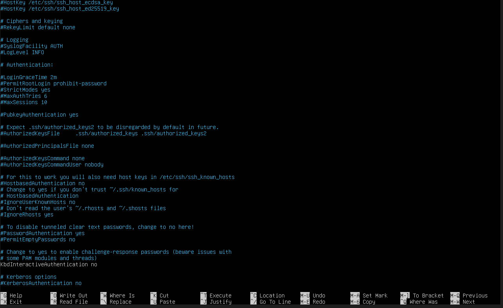
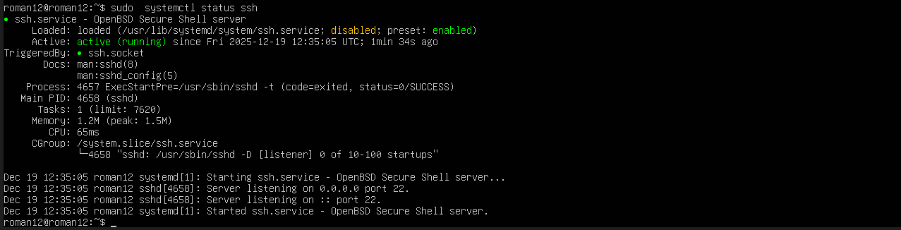

### 2. Firewall Configuration:
- **Restrict Inbound Traffic**: Use a stateful firewall to allow only necessary services and ports (e.g., HTTP, SSH).
- **Block Unnecessary Ports**: Close all unused ports (e.g., telnet, ftp) using UFW or iptables.
- **Rate Limiting**: Implement rate limiting on sensitive ports (e.g., SSH) to prevent brute force attacks.
- **Default Deny Policy**: Set the firewall to deny all incoming by default and allow only specific services.
- **Log Dropped Packets**: Enable logging of dropped packets to detect potential attack attempts.
 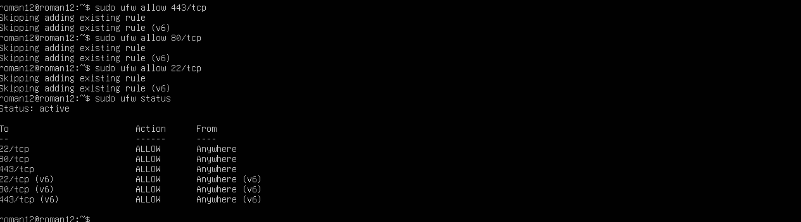 

### 3. Mandatory Access Control (MAC):
- **AppArmor/SELinux**: Enable and configure AppArmor or SELinux for mandatory access control to restrict system-level access for applications.
- **Profiles for Critical Services**: Define strict AppArmor/SELinux profiles for critical services to prevent unauthorized actions.

  

#### Key Observations:
- **Processes in Enforce Mode**: This is the ideal configuration for security because it actively restricts the behavior of applications based on their AppArmor profile.
- **Processes in Complain Mode**: This is useful for logging and monitoring. You can gradually move processes from complain mode to enforce mode after you have reviewed the logs and verified their behavior.
- **Unconfined Processes**: These are applications not being controlled by AppArmor, which may pose a security risk. You should consider creating profiles for these services.
- **Mixed Mode**: For processes in mixed mode, you may want to investigate the profile definitions to make sure they are appropriately restrictive.

   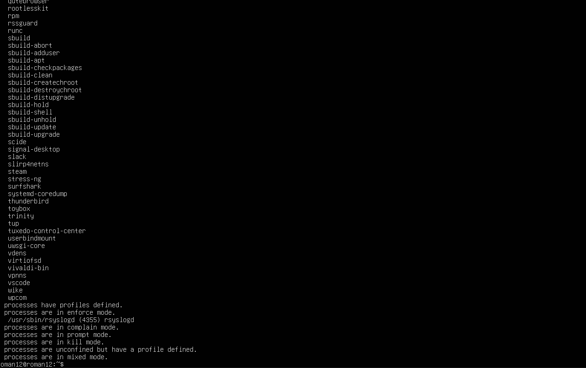

### 4. Automatic Updates:
- **Enable Unattended Upgrades**: Ensure automatic security updates are enabled with unattended-upgrades to minimize vulnerabilities.
- **Schedule Manual Updates**: Set a weekly or monthly schedule for manual updates for non-security patches.
- **Verify Update Configuration**: Check /etc/apt/apt.conf.d/50unattended-upgrades for proper configuration.
   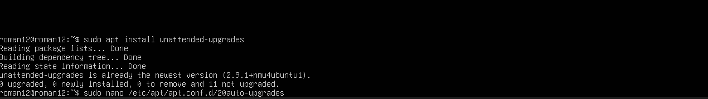
  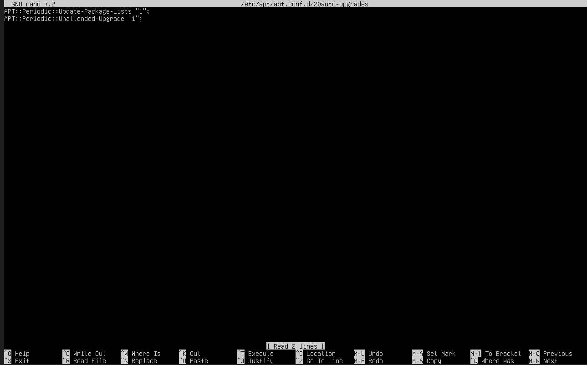

### 5. User Privilege Management:
- **Least Privilege Principle**: Grant users only the minimum necessary privileges for their roles.
- **Use sudo for Privileged Access**: Ensure that users who need elevated privileges use sudo instead of logging in as root.
- **Audit Sudo Access**: Monitor and log all sudo command usage to detect unauthorized privilege escalation.
- **Regular Review of Users and Groups**: Periodically review system users and group memberships to remove unnecessary access.
  

### 6. Network Security:
- **Intrusion Detection System (IDS)**: Use Snort or OSSEC for real-time monitoring and alerting on suspicious activity.
- **VPNs for Remote Access**: Ensure remote access is only available through secure VPNs (e.g., WireGuard).
- **TLS for Web Traffic**: Enforce HTTPS on all web traffic using valid SSL certificates (e.g., Let's Encrypt).
- **Network Segmentation**: Isolate critical services (e.g., databases) from the public network using VLANs or separate subnets.

---

# Threat Model

## Objective:
Identify and mitigate potential threats that could exploit vulnerabilities within the system. This threat model outlines specific security threats and their corresponding mitigation strategies.

### Threat 1: Unauthorized Access via SSH Brute Force Attack
- **Description**: Attackers may attempt to gain unauthorized access to the system by guessing SSH passwords or using brute-force attacks on weak or default credentials.
- **Mitigation**:
  - **SSH Key Authentication**: Enforce SSH key-based authentication and disable password authentication.
  - **Fail2Ban**: Use Fail2Ban to automatically block IP addresses after several failed login attempts.
  - **Limit SSH Access**: Restrict SSH access to trusted IP addresses using the firewall (UFW or iptables).
  - **Two-Factor Authentication**: Implement 2FA for SSH access to add an extra layer of protection.
    

### Threat 2: Malware Injection via Vulnerable Web Application
- **Description**: Web applications may be targeted by attackers who exploit vulnerabilities (e.g., SQL injection, XSS) to inject malware or steal sensitive data.
- **Mitigation**:
  - **Input Validation**: Sanitize and validate all user inputs to prevent malicious code execution.
  - **Web Application Firewall (WAF)**: Use a WAF to filter and monitor HTTP traffic and prevent common web attacks.
  - **Regular Security Audits**: Perform regular security audits and code reviews of the application to find and fix vulnerabilities.
  - **Patch Management**: Regularly update all software packages, including web servers, databases, and CMS.
   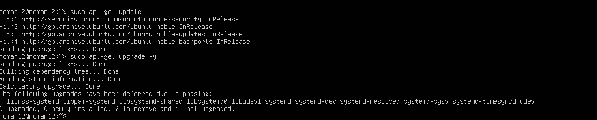

### Threat 3: Insider Threat
- **Description**: Employees or contractors with privileged access may intentionally or unintentionally cause harm by leaking sensitive data or performing unauthorized actions.
- **Mitigation**:
  - **Principle of Least Privilege**: Grant users the minimum required permissions to perform their job functions.
  - **User Activity Monitoring**: Implement logging and monitoring of privileged user actions, including file access, command usage, and login attempts.
  - **Data Encryption**: Encrypt sensitive data both at rest and in transit to prevent unauthorized access.
  - **Regular Access Reviews**: Periodically review user access levels and ensure users still need access to critical systems.

