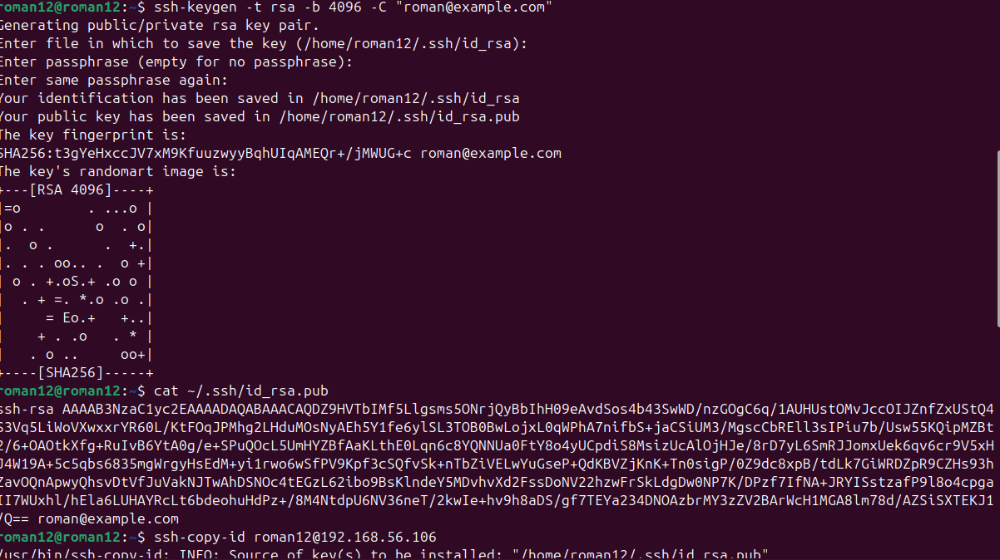
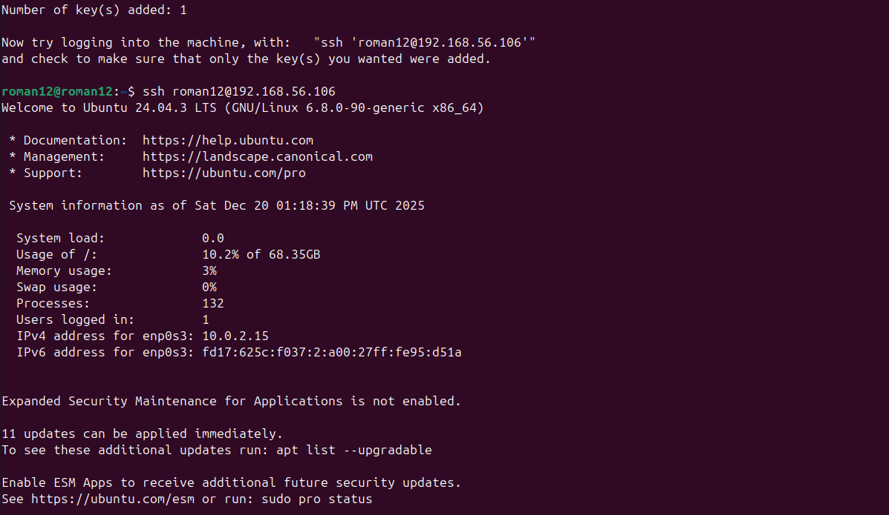
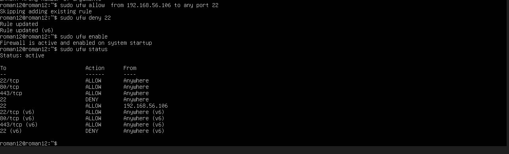
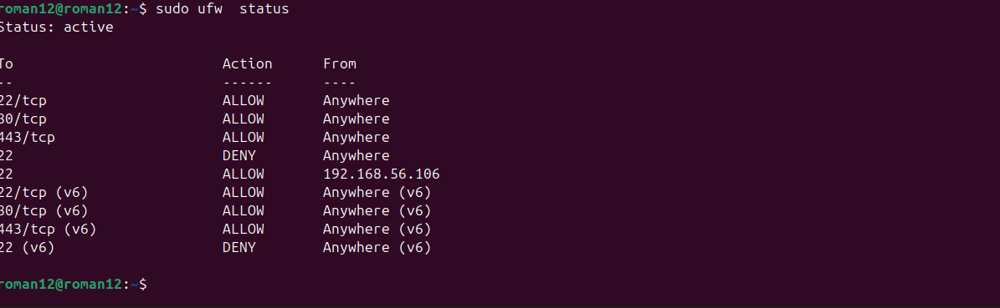
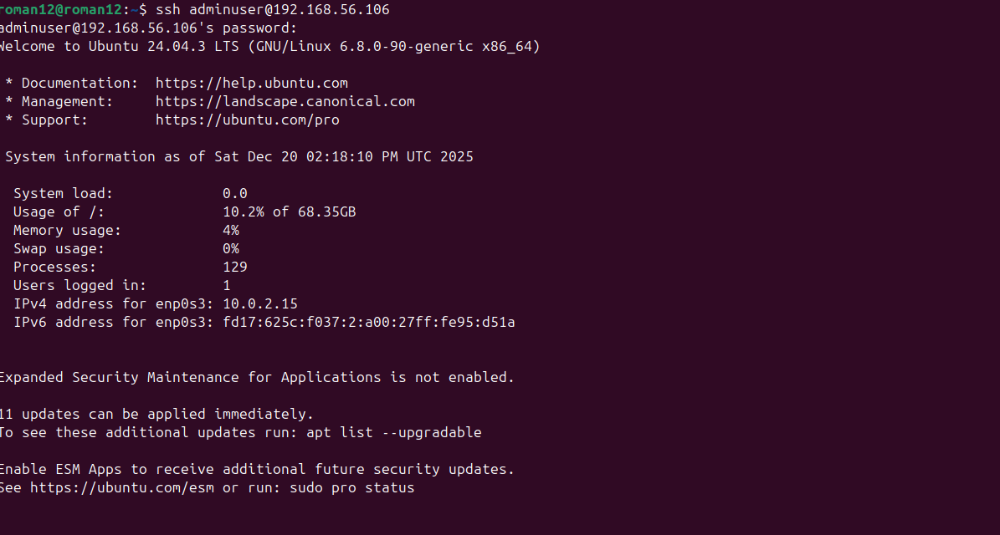
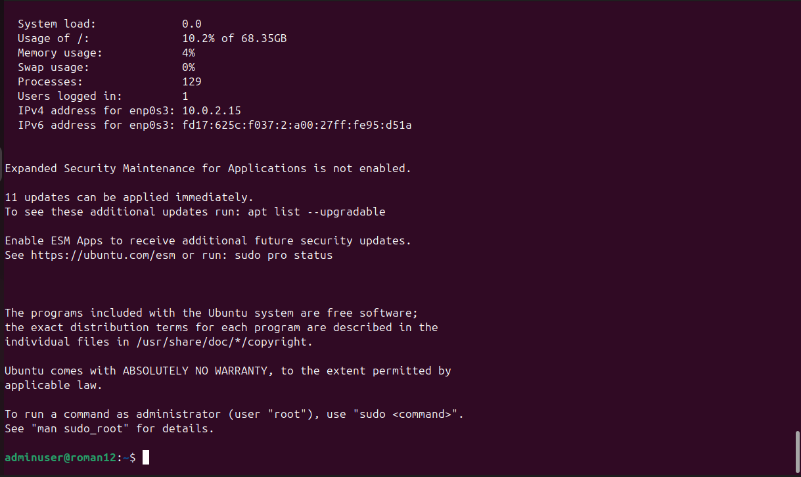

# Phase 4: Initial System Configuration & Security Implementation

## Objective:
This phase focuses on securing the server and ensuring all management operations are carried out via SSH from a trusted workstation.

---

## 1. Configure SSH with Key-Based Authentication
**Objective:** To eliminate password-based login and enhance security, key-based authentication is configured.

### Steps Taken:

1. **Generate SSH Key Pair on Workstation:**
   
    ssh-keygen -t rsa -b 4096 -C "roman email@example.com"
  

2. **Copy the Public Key to the Server:**
   
    ssh-copy-id username@server_ip
  

3. **Disable Password Authentication:**
    - Edit the SSH configuration file (`/etc/ssh/sshd_config`):
      
      sudo nano /etc/ssh/sshd_config
   
    - Set `PasswordAuthentication` to `no`:
      
      PasswordAuthentication no
    

4. **Restart SSH Service:**
    
    sudo systemctl restart ssh

   **Evidence**
   

   
    

---

## 2. Configure a Firewall Permitting SSH from One Specific Workstation Only
**Objective:** Restrict SSH access to the server to a specific workstation (IP address).

### Steps Taken:

1. **Allow SSH from Trusted IP Only:**
    - Configure the firewall to only allow SSH connections from a specific IP:
   
      sudo ufw allow from [trusted_ip] to any port 22
    

2. **Deny Other SSH Connections:**
    
    sudo ufw deny 22
  

3. **Enable the Firewall:**
    
    sudo ufw enable
    

4. **Check Firewall Status:**
    
    sudo ufw status
   

**Outcome:** SSH access will be limited to the specified workstation IP address only, enhancing security.

 

 
 

## 3. Manage Users and Implement Privilege Management
**Objective:** Create a non-root administrative user with limited privileges and ensure least privilege for user management.

### Steps Taken:

1. **Create a New User:**
    
    sudo adduser adminuser
  

2. **Add the User to Sudo Group:**
   
    sudo usermod -aG sudo adminuser

3. **Ensure Proper Permissions:**
    - Set file permissions for specific directories and files based on user roles.

4. **Verify User Privileges:**
      sudo -l -U adminuser
  

**Outcome:** The new user will have administrative privileges but will not have unrestricted access to the entire system.
 

 
 

## 4. SSH Access Evidence Showing Successful Connection
**Objective:** Capture evidence of a successful SSH connection to the server.

### Steps Taken:

- After SSH key-based authentication is set up, log into the server using the SSH key from the workstation:

  ssh username@server_ip

