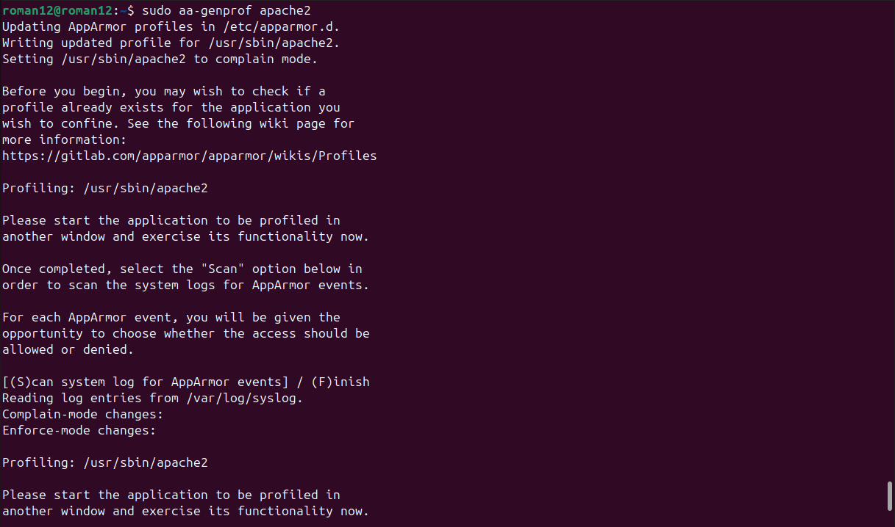
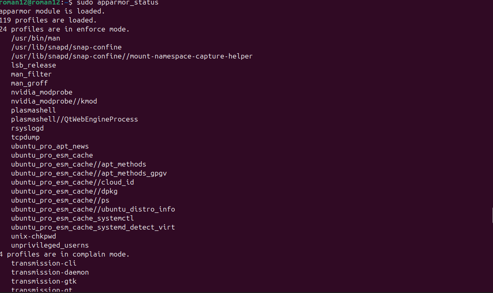
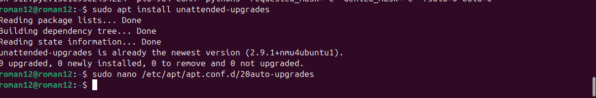
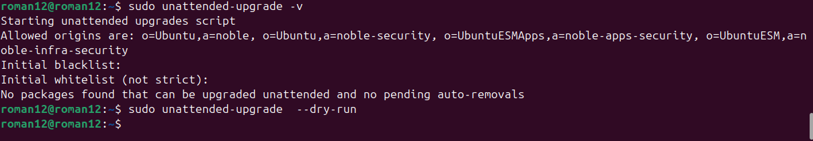
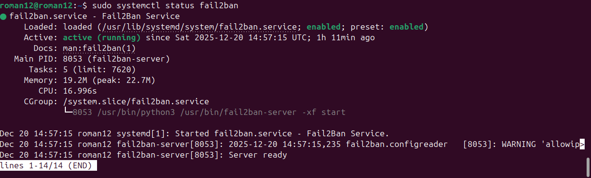
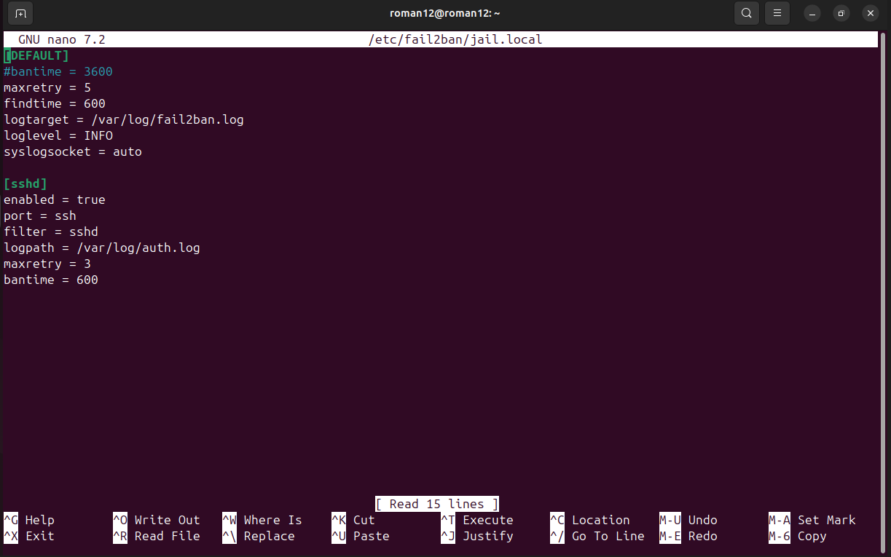
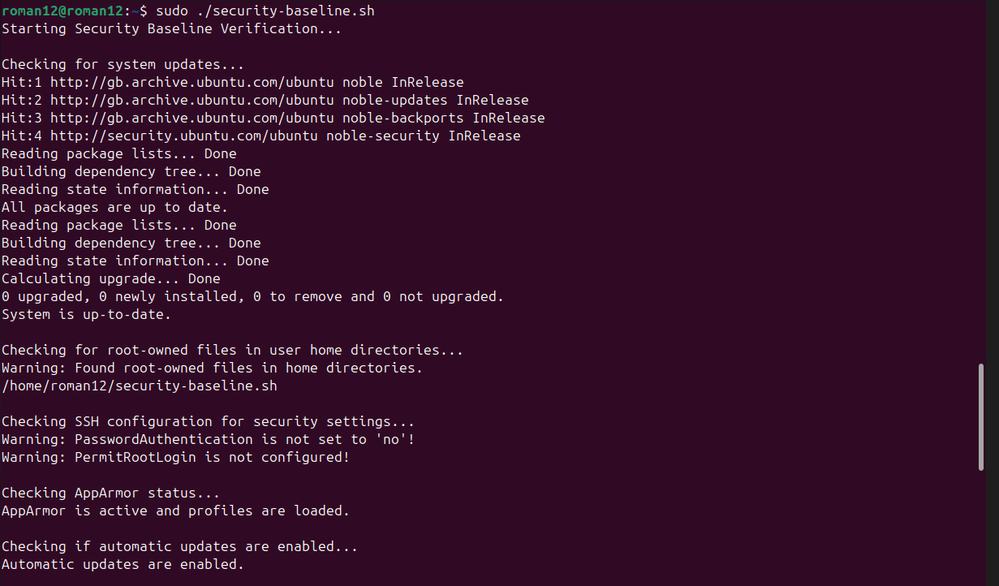
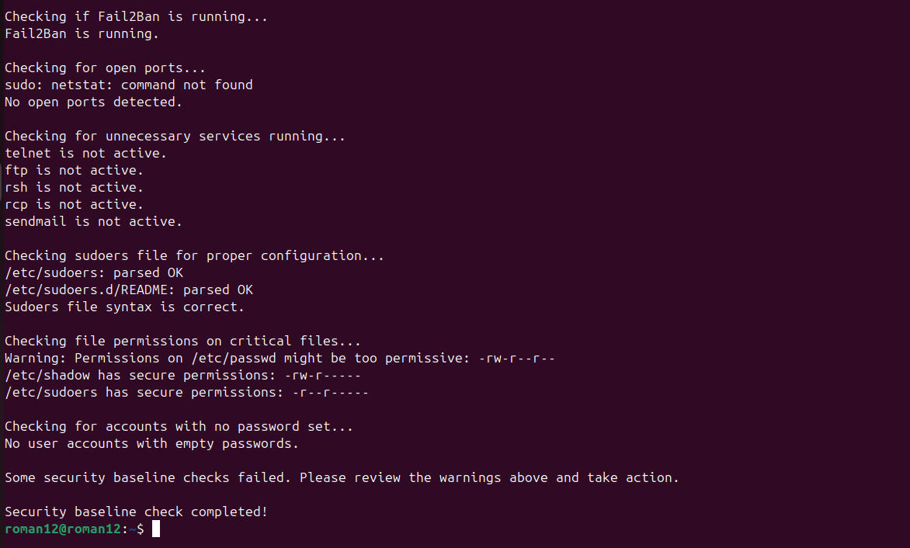

# Phase 5: Advanced Security and Monitoring Infrastructure

## Objective
Implement advanced security measures and create monitoring infrastructure for the server.

### 1. Access Control Using AppArmor
- AppArmor was installed and configured to restrict the Apache2 service.
- The Apache2 service was isolated from other system resources to reduce security vulnerabilities.

### 2. Automatic Security Updates
- The system was configured to automatically install security updates via `unattended-upgrades`.
- This ensures the server is kept up-to-date with security patches without manual intervention.

### 3. fail2ban for Intrusion Detection
- `fail2ban` was installed and configured to protect the SSH service from brute-force attacks.
- It automatically blocks IPs after a defined number of failed login attempts.

### 4. Security Baseline Verification Script
- A verification script (`security-baseline.sh`) was created to validate the status of security configurations such as SSH key authentication, AppArmor enforcement, and fail2ban operation.

### 5. Remote Monitoring Script
- A monitoring script (`monitor-server.sh`) was created to remotely gather and display system metrics such as CPU usage, memory usage, and disk I/O via SSH.

---

### Key Evidence

1. **AppArmor Configuration**:
   - Enforced AppArmor profiles for Apache2 to restrict service access.
     
     
   - Evidence: `apparmor_status` output.
     

2. **Unattended Security Updates**:
   - Automatic security updates enabled.

     
     
   - Evidence: `/etc/apt/apt.conf.d/20auto-upgrades` settings and dry-run output.

     

3. **fail2ban**:
   - SSH protection enabled with `fail2ban` to block brute-force IPs.
   - Evidence: `fail2ban` status and jail configuration file.
     

     

4. **Security Baseline Verification**:
   - Script that verifies all critical security configurations.
   - Evidence: Output showing correct security settings.

     

     

5. **Remote Monitoring**:
   - A script to gather system performance metrics remotely.
   - Evidence: Real-time output showing CPU, memory, and disk I/O usage.
  !  [monitoring](5.png)

---

### Conclusion

With the implementation of advanced security measures like AppArmor, automatic security updates, and fail2ban, along with continuous monitoring via custom scripts, the server environment is now secure, resilient to attacks, and monitored for performance. This ensures the ongoing health and security of the infrastructure.
