# Phase 6: Performance Evaluation and Analysis (Week 6)

## Objective:
To evaluate the system’s performance under various workloads and identify potential bottlenecks in CPU, memory, disk I/O, network performance, system latency, and service response times. You’ll also aim to implement optimizations and document improvements.

---

## Testing Methodology:

### 1. CPU Usage:
Measure how much of the CPU is being used during different workloads.
- **Command**: `top`, `htop`, or `mpstat`
- **Measurement Type**: CPU usage percentage

### 2. Memory Usage:
Monitor memory consumption, including cache and swap.
- **Command**: `free -h`, `vmstat`, `htop`
- **Measurement Type**: Memory usage (RAM, swap usage)

### 3. Disk I/O Performance:
Track read/write performance of the disk during high-load situations.
- **Command**: `iostat`, `dstat`, `fio`
- **Measurement Type**: Disk read/write speeds and I/O latency

### 4. Network Performance:
Evaluate the throughput and latency of network communications.
- **Command**: `ping`, `iperf`, `nload`
- **Measurement Type**: Throughput (Mbps) and Latency (ms)

### 5. System Latency:
Measure the delay between requests and responses.
- **Command**: `ping`, `traceroute`, `latencytest`
- **Measurement Type**: Latency (ms)

### 6. Service Response Times:
Measure how long services take to respond to requests.
- **Command**: Use application-specific command or `curl` for HTTP response times.
- **Measurement Type**: Response time in ms

---

## 1. Baseline Performance Testing

### Objective:
Establish a baseline performance by testing the system under normal, idle conditions. This provides a reference point for performance comparisons later.

### What to do:
- Monitor resource usage when the system is idle, with minimal load or background processes.
- Measure CPU, memory, disk I/O, and network performance to understand the system's typical state.

### Steps:
1. Run the system with minimal load (no active users or processes).
2. Collect baseline metrics:
   - CPU usage using `top`, `htop`, or `mpstat`.
   - Memory usage using `free -h`, `vmstat`, or `htop`.
   - Disk I/O performance using `iostat` or `dstat`.
   - Network latency using `ping`.
   Result
htop
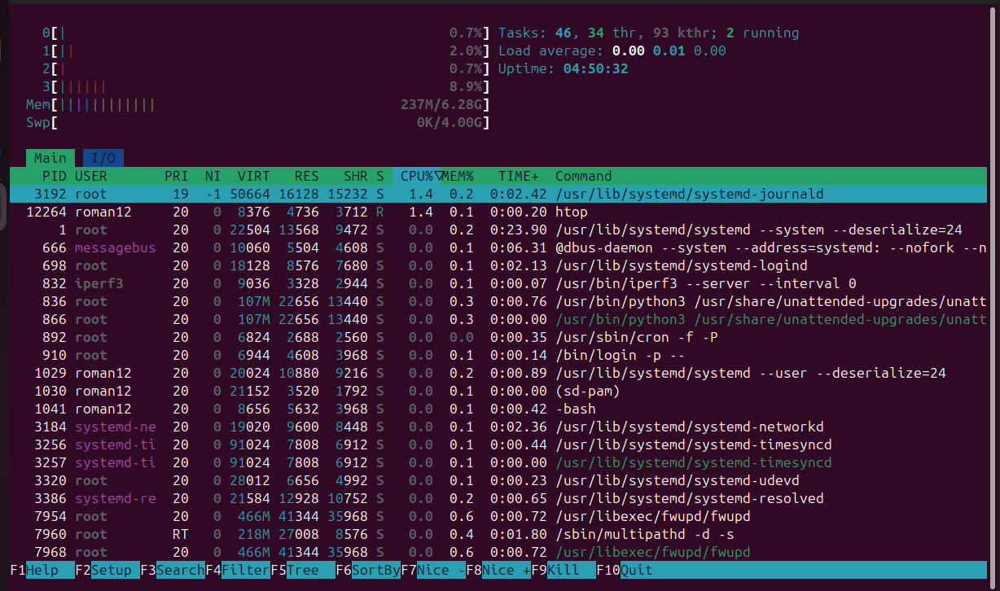

vm stat
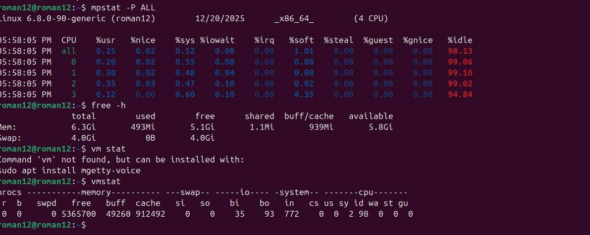

iostat

ping 
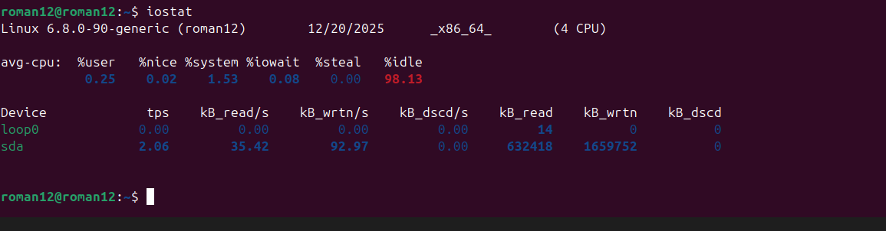

mpstat

### Outcome:
- CPU usage: Should be low (1-10%).
- Memory usage: Should show reasonable baseline values based on your system specs.
- Disk I/O: Minimal disk activity.
- Network latency: Should be under 100ms in most environments.

---

## 2. Application Load Testing

### Objective:
Simulate real-world usage and stress the system with multiple users or requests. This will help to identify how the system behaves under increased load.

### What to do:
- Simulate concurrent users or requests to observe how the system performs under load.
- Test system performance under various traffic conditions.

### Steps:
1. Use Apache JMeter, siege, or ab (Apache Benchmark) to simulate user traffic.
   - **ab example:**
     - `ab -n 1000 -c 10 http://server_ip/`
       - `-n 1000`: Number of requests.
       - `-c 10`: Number of concurrent requests.
         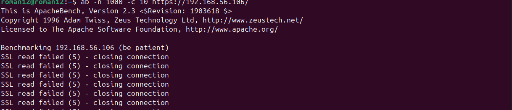

         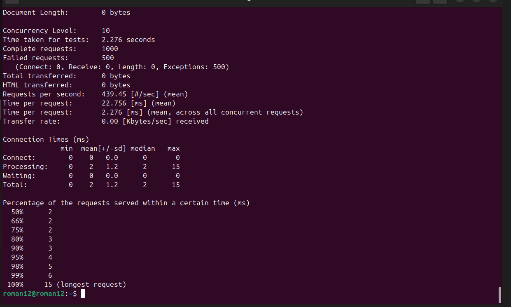
2. Monitor the server performance during the test using tools like `top`, `htop`, `iostat`, and `nload`.
3. Record response time, CPU, memory, and disk I/O.

    htop
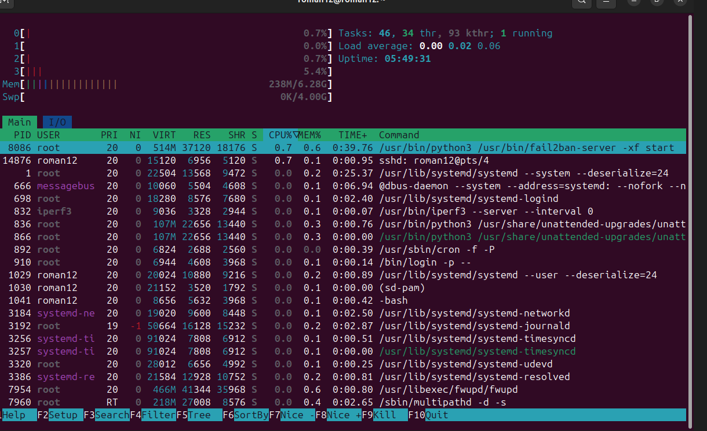

iostat
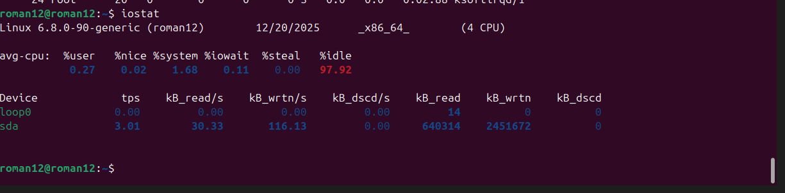

 top 
 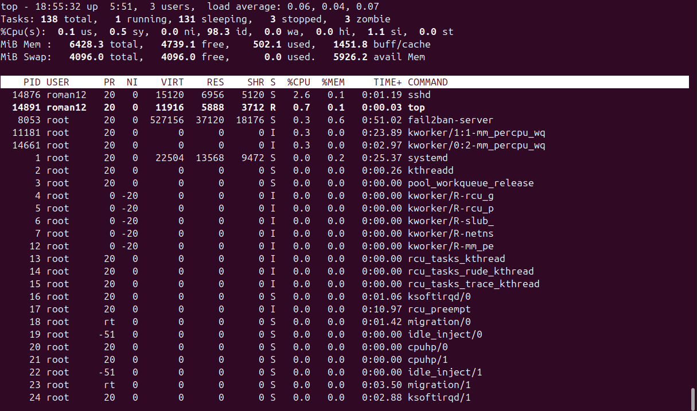

 nload
 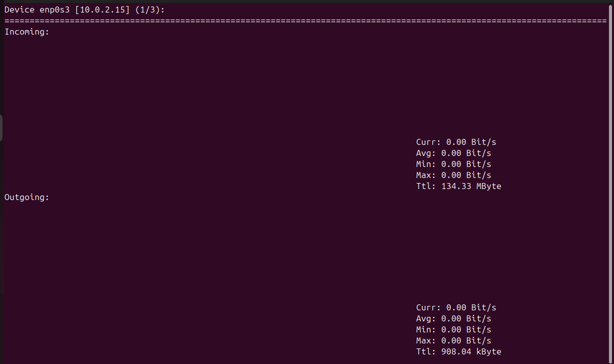

## 3. Performance Analysis Identifying Bottlenecks

### Objective:
Identify which system resource (CPU, memory, disk, network) is causing performance issues under load.

### What to do:
- Analyze the metrics collected during load testing to pinpoint bottlenecks.
- Look for signs of resource exhaustion or inefficiencies.

### Steps:
1. Compare baseline metrics with load testing results to identify any significant differences.
2. Identify where the system is getting "stuck":
   - High CPU usage: Look at `top` or `mpstat` to see which processes are consuming the most CPU.
   - High memory usage or swapping: Check `free -h` or `vmstat` for signs of swapping.
   - Disk I/O bottlenecks: Use `iostat` to see if read/write speeds are becoming a bottleneck.
   - Network congestion: Check `nload` or `iperf` to see if network throughput is maxed out.
3. Review logs or system metrics to help identify processes or areas contributing to resource exhaustion.

### Outcome:
- Identify bottlenecks like high CPU usage, memory swapping, disk I/O delays, or network congestion.
- Capture the impact of load on the system resources, identifying the most strained resource.
top

free-h

nload
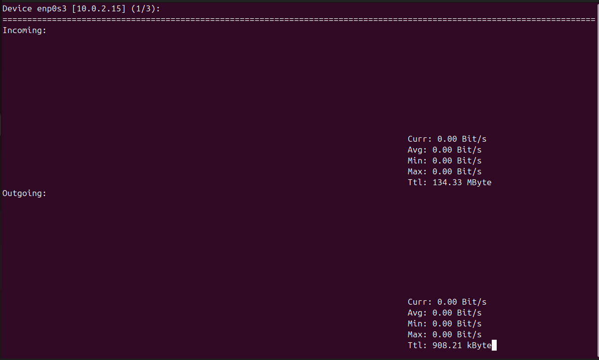

mp stat 
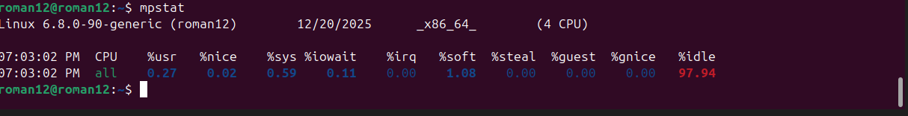

iostat
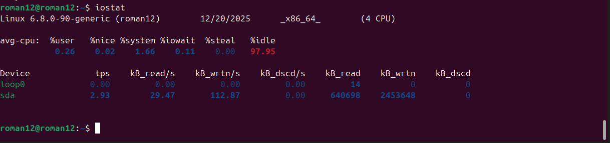

## 4. Optimisation Testing

### Objective:
Test the effectiveness of optimizations applied to address the bottlenecks identified during performance analysis.

### What to do:
- Apply changes like optimizing configuration, increasing resources, or tuning system parameters.
- Re-run the load tests and compare performance results with baseline and load testing data.

### Steps:
1. Based on the bottleneck findings, apply optimizations:
   - If CPU is the bottleneck: Increase the number of CPU cores or adjust CPU affinity.
   - If memory is the bottleneck: Increase RAM or optimize memory allocation.
   - If disk I/O is the bottleneck: Switch to faster storage (e.g., SSD) or optimize disk access patterns.
   - If network is the bottleneck: Optimize network configuration or increase bandwidth.
2. Re-run the load tests and collect performance metrics again.
3. Compare results before and after optimizations (e.g., lower response times, reduced CPU usage).

### Outcome:
htop
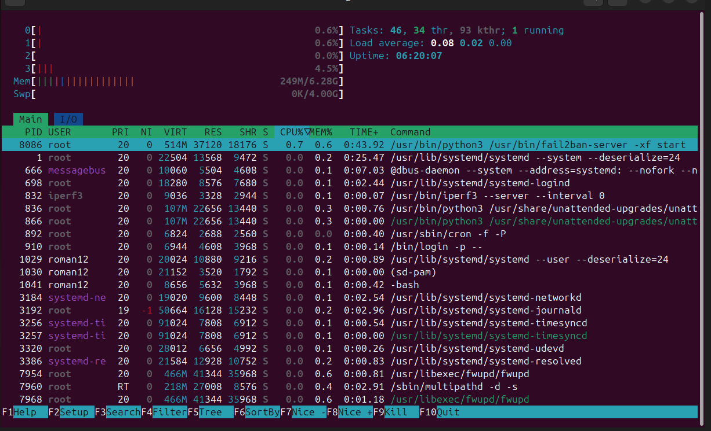

iostat

nload
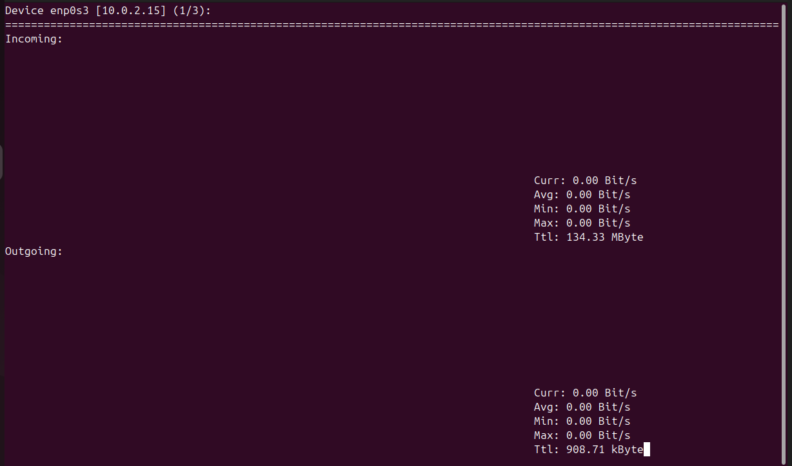

## 5. Stress Testing

### Objective:
Push the system beyond normal operational limits to see how it behaves under extreme conditions.
- Apply an extreme load to the system (e.g., 2x or 3x the expected maximum user load) to see how it reacts.
- Check how the system handles failures or degradation under stress.

### Steps:
1. Use Apache to generate an extreme load on the system.
2. Monitor system performance closely (CPU, memory, disk, network) and note the system’s behavior under extreme conditions.
3. Record system behavior during crashes or slowdowns, noting any thresholds where performance drastically drops.

### Expected Outcome:
after stress
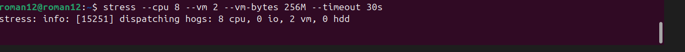

iostat
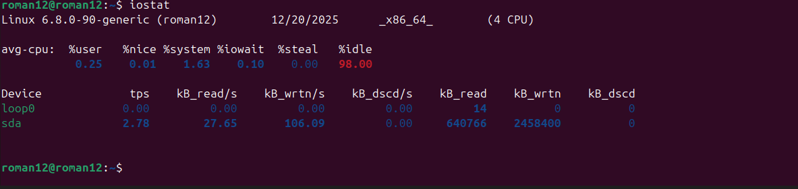

 nload
 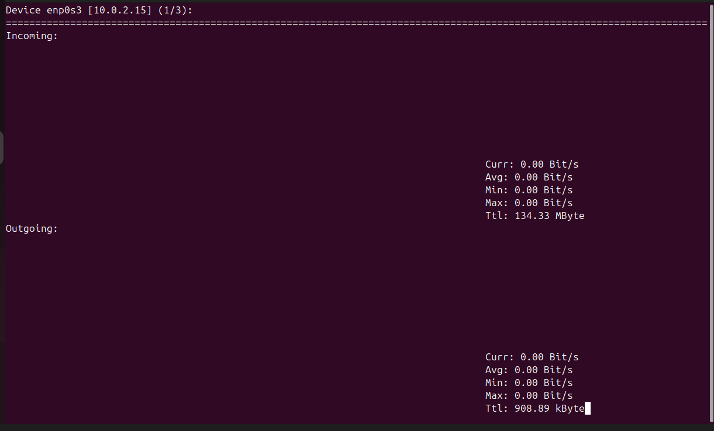
---

## Conclusion:

This document provides a comprehensive and structured approach to Phase 6: Performance Evaluation and Analysis. It includes clear objectives, methodologies, testing procedures, and expected outcomes for each step of the process. Additionally, it ensures a logical flow from baseline testing to load testing, performance analysis, optimization, and stress testing, with expected outcomes identified in advance.
