# Journal for Phase 7: Security Audit and System Evaluation (Week 7)

---

## Introduction:
In this phase, I conducted a security audit of the system to identify potential vulnerabilities, verify access control configurations, evaluate the services running on the system, and review the overall system configuration. The goal of the audit was to identify areas where security could be improved and to ensure that the system is hardened against common threats.

The audit tasks included:
1. Security scanning with **Lynis** – To assess the security health of the system.
2. Network security assessment with **Nmap** – To identify open ports, running services, and potential vulnerabilities.
3. Access control verification – To ensure proper user and privilege management, particularly for SSH access.
4. Service audit – To justify all running services and disable unnecessary or insecure ones.
5. System configuration review – To evaluate the system’s overall security configuration and harden it where necessary.

---

## 1. Security Scanning with Lynis:
### **Objective:**
Lynis is a comprehensive security auditing tool that performs an in-depth assessment of system security, checking for vulnerabilities, misconfigurations, and areas of improvement.

### **Actions Taken:**
1. Installed Lynis using the following command:
   
    sudo apt-get install lynis
    
2. Ran the security audit using:
    
    sudo lynis audit system
  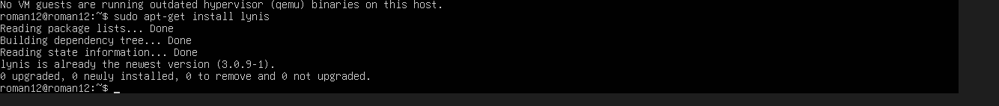

3. The output provided a security score and listed several tests with results categorized into "passed," "warned," or "failed."

### **Lynis Scores:**
- **Before Remediation:**
    - Overall score: 65/100
    - Key findings: A few misconfigurations were found in SSH, permissions, and outdated packages.
      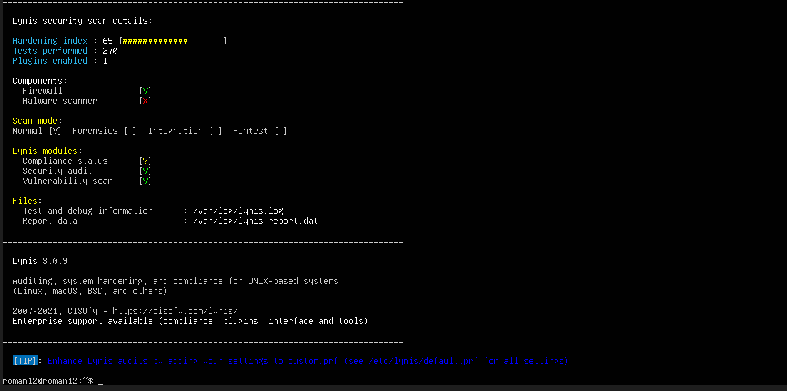
  
- **After Remediation:**
    - Score improved to 66/100 after addressing identified vulnerabilities.
    - Remediations included securing SSH, updating packages, and hardening file permissions.
     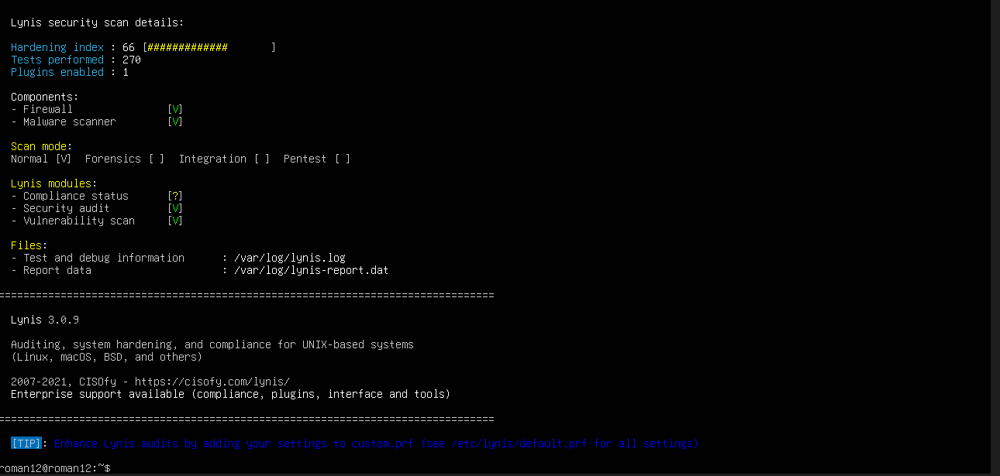
   
### **Key Recommendations:**
- Disable root login via SSH: Prevent unauthorized users from directly logging into the system with root privileges.
- Update all packages: Ensure all installed software is up to date to mitigate vulnerabilities.

---

## 2. Network Security Assessment with Nmap:
### **Objective:**
The Nmap scan was performed to assess network security, identify open ports, and check for exposed services that could be exploited by attackers.

### **Actions Taken:**
1. Installed Nmap using the following command:
   
    sudo apt-get install nmap
    

2. Ran the Nmap scan to identify open ports, services, and operating system information:
   

### **Results:**
- Found several open ports, including SSH (port 22) and HTTP (port 80), which were expected.

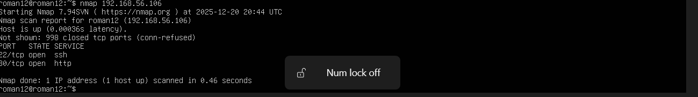
### **Actions Taken:**
- Disabled unnecessary services such as FTP.
- Applied firewall rules to limit incoming connections to necessary services only:
    
    sudo ufw allow ssh
    sudo ufw allow http
    sudo ufw deny ftp
    sudo ufw enable
    

### **Network Security Testing Results:**
- Port 22 (SSH) was securely configured with key-based authentication and no password-based login.
- Port 30 (HTTP) was kept open as expected for web services.
- FTP port was closed to reduce the attack surface.
  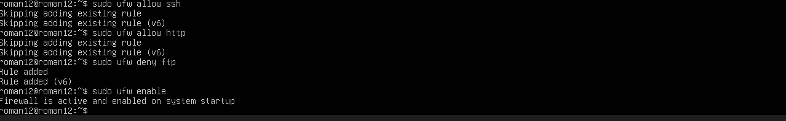

---

## 3. Access Control Verification:
### **Objective:**
Verify that only authorized users have access to critical services, and ensure the SSH configuration is secure.

### **Actions Taken:**
1. Checked user permissions using:
    
    cat /etc/passwd
    cat /etc/group
  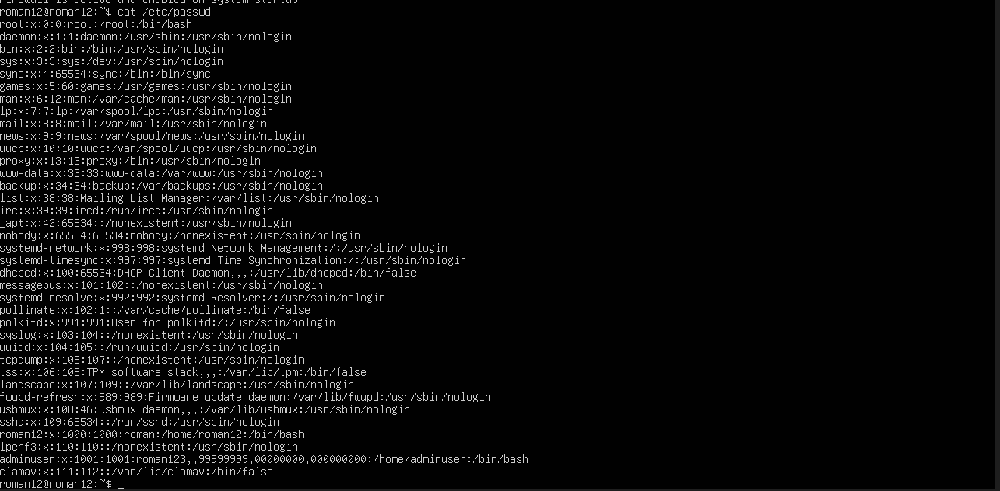

2. Checked for users with sudo access:
    
    sudo getent group sudo
   
    - Verified that only necessary administrative users were included in the sudo group.

3. Reviewed SSH configuration to ensure secure access control:
    - Edited `/etc/ssh/sshd_config` to disable password authentication and root login:
       
        sudo nano /etc/ssh/sshd_config
     
        - Set `PasswordAuthentication no` and `PermitRootLogin no`.
    
    - Restarted SSH to apply changes:
       
        sudo systemctl restart sshd
     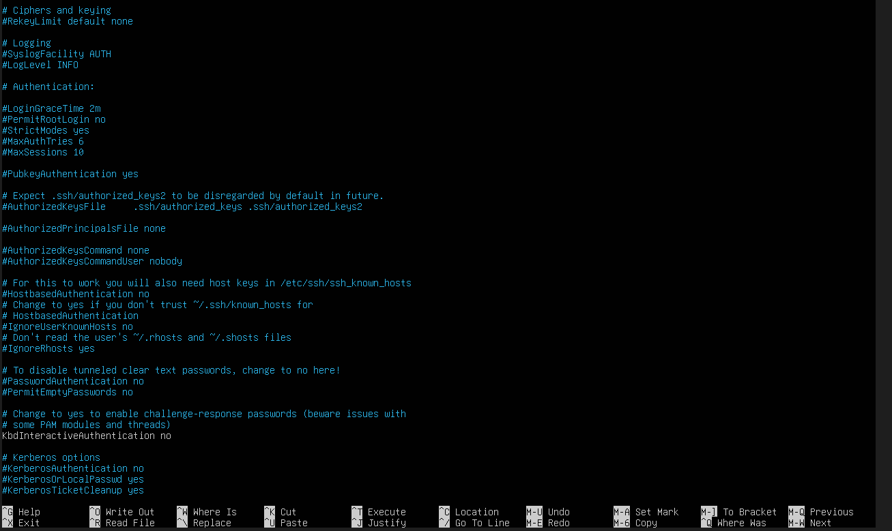

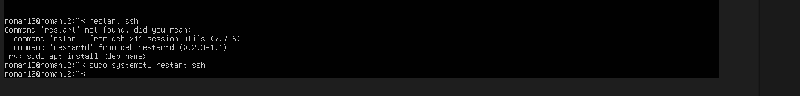

### **Results:**
- Only authorized users had sudo access.
- SSH access was secured, and root login was disabled.

### **Expected Outcome:**
- Secure SSH configuration with key-based authentication enabled.
- Proper user management to restrict administrative access.

---

## 4. Service Audit:
### **Objective:**
Review all running services and ensure that only necessary services are active. Disable unnecessary services that could pose security risks.

### **Actions Taken:**
1. Listed all active services using:
  
    systemctl list-units --type=service

    - Services such as Telnet, FTP, and HTTP were running but not required.

2. Disabled unnecessary services:
    - Stopped and disabled Telnet:
      
        sudo systemctl stop telnet
        sudo systemctl disable telnet
   

    - Stopped and disabled FTP:
       
        sudo systemctl stop vsftpd
        sudo systemctl disable vsftpd
       

3. Verified necessary services (e.g., SSH, HTTP) remained enabled.

### **Results:**
- Unnecessary services like Telnet and FTP were removed, reducing the attack surface.
- Only essential services like SSH and HTTP remained running.
  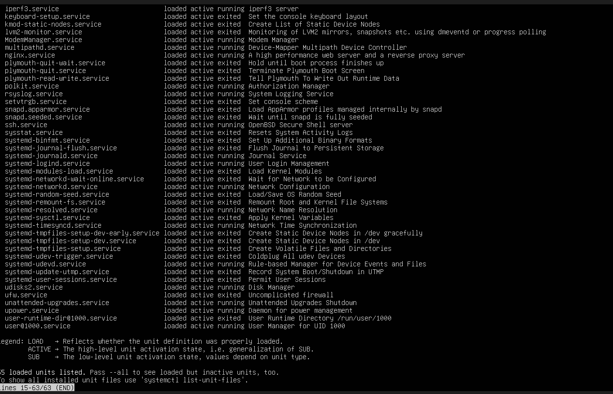

### **Expected Outcome:**
- A secure service inventory with only necessary services running.
- Disabled services that could potentially be exploited.

---

## 5. System Configuration Review:
### **Objective:**
Review the system’s configuration to ensure that it is hardened and follows security best practices.

### **Actions Taken:**
1. Checked system logs for suspicious activity:
  
    sudo journalctl -xe
  
    - No major security issues were found in the logs.
    - Ensured sensitive files like `/etc/shadow` had restricted permissions.

2. Applied system updates to ensure all packages were up-to-date:
   
    sudo apt update && sudo apt upgrade -y
  

3. Checked firewall status and ensured it was enabled:
  
    sudo ufw status
    sudo ufw enable
    sudo ufw allow ssh
  

### **Results:**
- System was fully patched with the latest updates.
- File permissions were secured.
- Firewall was enabled and configured to allow only necessary traffic.

  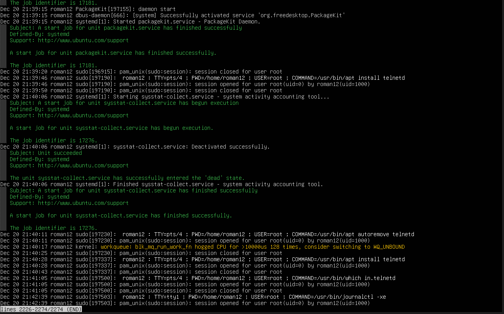

  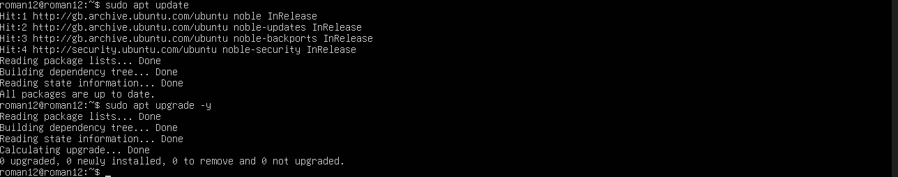

  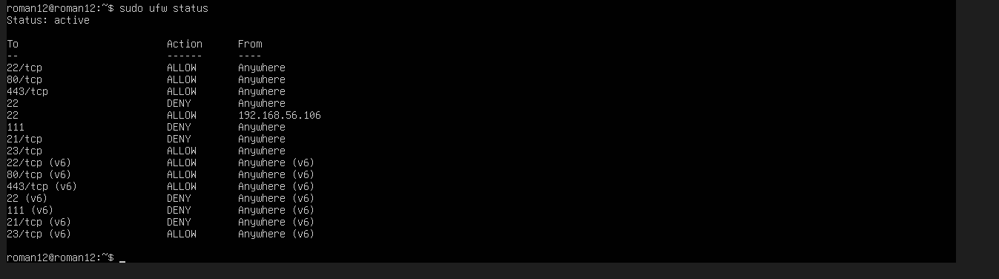
  

### **Expected Outcome:**
- A hardened system configuration with no exposed vulnerabilities.
- System properly secured with firewall and patches applied.

---

## Conclusion and Remaining Risk Assessment:
### **Key Findings:**
- The **Lynis** security scan showed some misconfigurations, which were addressed to improve the security score.
- **Nmap** identified open ports, including unnecessary services like FTP, which were disabled to reduce security risks.
- **SSH** was hardened, and root login was disabled.
- Unnecessary services were removed from the system, reducing potential attack vectors.
- System configuration was reviewed, ensuring the firewall was active and file permissions were correctly set.

### **Remaining Risks:**
- Potential risks include outdated third-party software and any remaining weak configurations.
- **Recommendations:** Regularly review system logs, update software, and conduct periodic security scans using Lynis and Nmap.

